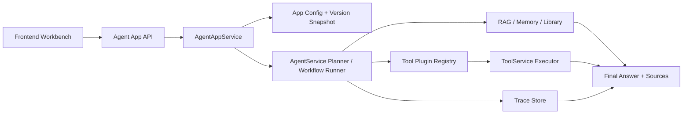
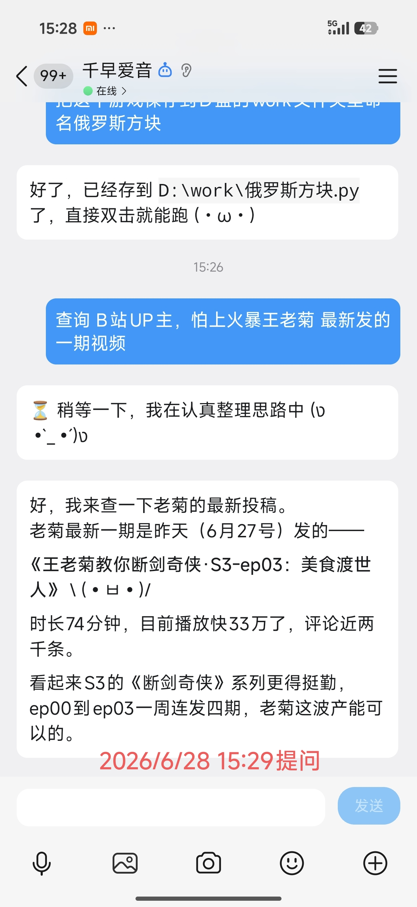

<p align="center">
  
</p>

<h1 align="center">🐟 CaiBao <sup>彩宝</sup></h1>

<p align="center">
  <strong>轻量级 AI Agent 工作台</strong><br>
  创建 Agent App、配置知识库、接入工具插件，聊聊就把活干了。
</p>

<p align="center">
  
  
  
  
  
</p>

---

## 是什么

CaiBao 是一个 Dify-lite 风格的 Agent 搭建平台。你可以在上面创建 AI Agent 应用，给它配模型、接知识库、装工具插件，然后通过 Web 工作台或 API 来用。

- 🤖 **Agent App Builder** — 创建/配置/发布/调用，含版本快照
- 🧠 **Function Calling 引擎** — 自实现 OpenAI 兼容 tool_calls 多轮循环
- 📡 **SSE 流式执行** — 实时输出推理过程、工具状态、确认请求
- 📚 **RAG 知识库** — 上传 PDF/Word/Excel/图片，Agent 回答带来源追溯
- 🔧 **工具注册表** — 内置 + MCP 协议 + 插件，统一管理权限和危险等级
- 🔒 **安全边界** — 危险操作需确认 + dry_run 预览 + max_tool_calls 预算
- 🎭 **双人格** — Web 端企业助手 / QQ Bot 闲聊伙伴，按渠道自动切换
- 🧩 **插件系统** — 事件总线 + 生命周期钩子 + 工具拦截器
- 📝 **多层记忆** — 会话记忆 / 记忆卡 / 知识库，三级沉淀
- 🧪 **双评测体系** — Agent Eval + App Eval，7 项指标自动输出报告

---

## 架构



六层结构：**API** → **Service**（Agent 引擎 / RAG / LLM 路由）→ **Tool**（注册 + MCP + 安全预检）→ **Data**（PostgreSQL / SQLite + Alembic）→ **Event**（事件总线 + 插件）→ **Frontend**（纯 HTML/CSS/JS）

---

## 快速开始

### Docker（推荐）

```bash
cp .env.example .env   # 修改 AUTH_JWT_SECRET / POSTGRES_PASSWORD / LLM_API_KEY
docker compose up --build -d
```

浏览器打开 `http://localhost:8000/`，健康检查 `http://localhost:8000/api/v1/health`。

容器内包含 PostgreSQL 16 + Alembic 自动迁移 + Tesseract OCR（中文）。

### 本地 Python

```bash
python -m venv .venv && source .venv/bin/activate   # Windows: .venv\Scripts\Activate.ps1
pip install -r requirements.txt && cp .env.example .env
uvicorn app.main:app --host 0.0.0.0 --port 8000 --reload
```

> 详见 [`LOCAL_DEV_RUNBOOK.md`](LOCAL_DEV_RUNBOOK.md)

---

## 集成

| 集成 | 说明 |
|------|------|
| 🐧 **QQ Bot** | NapCat + QQ 官方双通道，群聊/私聊多轮对话，SSE 流式 |
| 🔗 **MCP 协议** | JSON-RPC 2.0 stdio 客户端，自动发现、命名空间隔离、工具白名单、手动重载 |
| 🌐 **Web 搜索** | Exa / Brave / Tavily + web_fetch（SSRF 防护） |
| 📁 **文件 / Shell** | 沙箱文件读写 + 命令执行（Shell 默认关闭） |
| 🖥️ **CLI 编码代理** | Claude Code / Codex / Pi 三后端，run_mode 一键委派，JSONL 事件流映射 SSE（默认关闭） |

<details>
<summary><b>启用 MCP</b></summary>

```bash
# 1. MCP 服务器依赖（官方 MCP SDK，仅 mcp-servers/ 下的服务器需要）
pip install -r mcp-servers/requirements.txt

# 2. 配置服务器列表（内置 utils 示例开箱即用）
cp config/mcp_servers.example.json config/mcp_servers.json

# 3. .env 中开启总开关
echo 'MCP_ENABLED=true' >> .env
```

启动后调用 `POST /api/v1/mcp/servers/reload`（dev-admin）或任意 Agent 对话即可完成连接；
`GET /api/v1/mcp/servers` 查看状态，`GET /api/v1/mcp/tools` 查看以 `mcp__{server}__{tool}` 命名的工具。
添加第三方服务器只需在 `config/mcp_servers.json` 的 `servers` 数组中追加 stdio 命令条目。

> 适用于本地 Python 运行。配置中的相对路径（`command`、`cwd`、`MCP_CONFIG_PATH`）以仓库根目录为基准解析；
> Windows 下 `command` 请改为 `.venv/Scripts/python.exe`。
> Docker 镜像暂未打包 `mcp-servers/` 与 MCP 依赖，容器内启用 MCP 需自行扩展镜像。

</details>

<p align="center">
  
</p>

---

## 评测

Agent Eval + App Eval 双评测，自动输出 7 项指标报告：

`task_success_rate` · `tool_selection_accuracy` · `parameter_accuracy` · `grounded_answer_rate` · `dangerous_action_block_rate` · `avg_latency_ms` · `avg_steps`

```bash
python scripts/agent_eval.py --base-url http://127.0.0.1:8000 \
  --user-id test --password pass --register \
  --dataset docs/agent_eval/dataset_minimal.json --output-dir docs/agent_eval/run
```

---

## 技术栈

**Python 3.11+** · **FastAPI** + Uvicorn · **PostgreSQL / SQLite** + SQLAlchemy 2.0 + Alembic · **JWT** + bcrypt · 自实现 OpenAI 兼容 LLM 客户端（DeepSeek / Qwen / 任意兼容方）· 自实现 MCP 客户端 · 自实现向量检索 · **纯 HTML/CSS/JS 前端** · Tesseract OCR 中文 · Docker 多阶段构建

> 💡 零 AI 框架依赖：没有 LangChain、LlamaIndex、sentence-transformers。Agent 引擎、RAG 链路、MCP 客户端全部自主实现。

---

## 近期更新

- **v0.26.0** — CLI 编码代理后端：Claude Code / Codex / Pi 以 `run_mode` 接入 Agent 引擎，多轮会话续接 + SSE 流式 + 执行轨迹持久化
- **v0.25.0** — MCP 链路打通：官方 SDK 服务器（mcp-servers/utils）+ clientInfo 协议修复 + UTF-8/超时/路径健壮性修复
- **v0.24.7** — HTTP 重试基础设施（指数退避 + jitter），接入 Exa / Brave / Tavily
- **v0.24.6** — B站工具 + `max_tool_calls` 预算 + DeepSeek reasoning_content 流式适配
- **v0.24.5** — QQ Bot 频道消息格式修复
- **v0.24.1** — 双人格 Persona 系统（企业助手 + 闲聊伙伴）
- **v0.19.0** — Agent 引擎现代化：Function Calling + SSE 流式 + LLM Router + App 工作台

[完整 changelog →](changelogs/)

---

## 参考

[`LOCAL_DEV_RUNBOOK.md`](LOCAL_DEV_RUNBOOK.md) · [`design/`](design/) · [`docs/`](docs/) · [`changelogs/`](changelogs/) · [`qqbot_adapter/`](qqbot_adapter/)

---

<p align="center">
  <sub>Made with ❤️ by <a href="https://github.com/zhibird">zhibird</a></sub>
</p>
