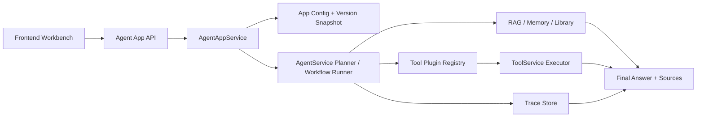

# CaiBao Dify-lite Agent App 工作台

CaiBao 是一个面向企业运维与知识管理场景的 Dify-lite Agent 应用搭建平台。用户可以创建 Agent App，配置提示词、模型、知识库、工具插件和轻量 workflow，通过工作台或 API 调用，并查看执行 trace、版本快照与 Agent/App Eval 报告。

## 项目预览

<p align="center">
  
</p>

## 核心能力

- **Agent App Builder**：`/api/v1/apps` 支持创建、更新、发布和调用可配置 Agent 应用。
- **LLM Function Calling Agent**：`agent_auto` 已升级为 OpenAI-compatible tools / `tool_calls` 驱动的多轮工具循环，保留关键词 fallback。
- **SSE 流式执行**：`/api/v1/agent/runs` 创建 queued run，`/api/v1/agent/runs/{run_id}/stream` 实时输出 LLM delta、工具状态、确认请求和最终结果。
- **LLM Router**：支持 planner / fast / vision 三类模型路由配置，当前 Agent 执行主链路已接入 planner 路由，fast / vision 作为后续专用步骤接入点保留。
- **Knowledge Base**：复用项目空间、资料库、结论与记忆卡，在 Agent 执行前注入可追溯上下文。
- **Tool Plugin Registry**：统一描述工具名称、展示名、参数 schema、输出 schema、handler、权限范围和危险等级。
- **Workflow Execution**：支持 `agent_auto` 自动规划模式，以及 `workflow` 节点顺序执行模式。
- **Trace / Observability**：每次运行都会落库 `agent_runs` / `agent_steps`，记录计划、检索、工具调用、观察结果、错误与耗时。
- **Safety Boundary**：`create_incident`、`create_memory_card`、`promote_to_conclusion` 等写入工具默认需要确认；`dry_run=true` 不产生副作用。
- **Agent Eval + App Eval**：保留原 Agent Eval，并新增 App 级评测集与报告脚本。

## Dify-lite 架构



## API 示例

创建并发布一个 Agent App：

```bash
curl -X POST "http://localhost:8000/api/v1/apps" \
  -H "Content-Type: application/json" \
  -b "your-auth-cookie" \
  -d '{
    "name": "运维值班助手",
    "mode": "agent_auto",
    "system_prompt": "你是企业运维知识 Agent，回答要基于资料，危险动作必须确认。",
    "tool_config": {
      "enabled_tools": ["search_knowledge", "list_recent_documents", "create_incident"],
      "dangerous_requires_confirmation": true
    }
  }'
```

```bash
curl -X POST "http://localhost:8000/api/v1/apps/your_app_id/publish" \
  -H "Content-Type: application/json" \
  -b "your-auth-cookie" \
  -d '{"notes": "baseline"}'
```

调用已配置的 Agent App：

```bash
curl -X POST "http://localhost:8000/api/v1/apps/your_app_id/invoke" \
  -H "Content-Type: application/json" \
  -b "your-auth-cookie" \
  -d '{
    "conversation_id": "your_conversation_id",
    "task": "数据库 CPU 告警了，查处理手册，判断是否要升级为 P1；如果需要，创建 incident。",
    "include_memory": true,
    "include_library": true
  }'
```

兼容保留原始 Agent 入口：

```bash
curl -X POST "http://localhost:8000/api/v1/agent/run" \
  -H "Content-Type: application/json" \
  -b "your-auth-cookie" \
  -d '{
    "conversation_id": "your_conversation_id",
    "task": "查最近文档，并创建一个 P1 incident：数据库 CPU 告警",
    "include_memory": true,
    "include_library": true,
    "dry_run": false
  }'
```

流式执行 Agent：

```bash
curl -X POST "http://localhost:8000/api/v1/agent/runs" \
  -H "Content-Type: application/json" \
  -b "your-auth-cookie" \
  -d '{
    "conversation_id": "your_conversation_id",
    "task": "查最近文档，判断数据库 CPU 告警是否需要升级为 P1 incident",
    "include_memory": true,
    "include_library": true
  }'
```

返回 `run_id` 与 `stream_url` 后，可通过 SSE 订阅：

```bash
curl -N "http://localhost:8000/api/v1/agent/runs/your_run_id/stream" \
  -b "your-auth-cookie"
```

默认返回 `requires_confirmation`，不会直接创建危险动作。确认后执行：

```bash
curl -X POST "http://localhost:8000/api/v1/agent/runs/your_run_id/confirm" \
  -H "Content-Type: application/json" \
  -b "your-auth-cookie" \
  -d '{}'
```

## 快速开始

### 本地 Python 运行

```bash
python -m venv .venv
. .venv/bin/activate
pip install -r requirements.txt
cp .env.example .env
uvicorn app.main:app --host 0.0.0.0 --port 8000 --reload
```

Windows PowerShell 可将激活命令替换为：

```powershell
.venv\Scripts\Activate.ps1
Copy-Item .env.example .env
```

启动后可访问：

- 前端首页：`http://localhost:8000/`
- 健康检查：`http://localhost:8000/api/v1/health`

## Docker 运行

### 1. 准备环境变量

```bash
cp .env.example .env
```

至少建议修改以下配置后再启动：

- `AUTH_JWT_SECRET`
- `POSTGRES_PASSWORD`
- `LLM_API_KEY`（如果你要接真实模型）

### 2. 启动服务

```bash
docker compose up --build -d
```

默认会启动两项服务：

- `postgres`：PostgreSQL 16
- `caibao-api`：FastAPI + Alembic 自动迁移

### 3. 首次启动会做什么

1. `postgres` 先启动并等待健康检查通过。
2. `caibao-api` 容器启动时会先执行 `alembic upgrade head`。
3. 迁移完成后再启动 `uvicorn`，并用 `/api/v1/health` 做容器健康检查。
4. 上传目录会落到 Docker volume 的 `/data/uploads`，重启容器后仍然保留。

### 4. 容器默认约束

- API 和 PostgreSQL 默认只绑定到本机回环地址：`127.0.0.1`
- 应用进程会以非 root 用户 `caibao` 运行
- 镜像内已包含 `tesseract-ocr` 与 `tesseract-ocr-chi-sim`
- `.dockerignore` 已排除本地数据库、缓存、输出目录和 `.env`

如果你需要让其他机器访问，可在 `.env` 中覆盖：

```env
APP_PORT=8000
POSTGRES_PORT=5432
```

并自行把 `docker-compose.yml` 中的 `127.0.0.1:` 端口绑定调整为对外暴露。

### 5. 常用命令

```bash
docker compose ps
docker compose logs -f caibao-api
docker compose logs -f postgres
docker compose exec caibao-api sh
docker compose down
```

如需连同数据库卷一起清理：

```bash
docker compose down -v
```

当前 Docker 镜像已经补齐：

- PostgreSQL 运行环境
- Alembic 启动迁移
- `/data` 持久化卷
- 容器健康检查
- 非 root 用户运行
- `tesseract-ocr` + `tesseract-ocr-chi-sim`，支持容器内中文 OCR

### 6. 发布建议

1. 正式环境请务必替换 `.env` 里的 `AUTH_JWT_SECRET`、`POSTGRES_PASSWORD` 和外部模型密钥。
2. 发布前建议至少执行一次 `docker compose up --build -d` 与 `docker compose logs --tail=100 caibao-api` 做烟测。
3. 若只更新前端资源但浏览器仍显示旧页面，先强刷页面，再确认 `app.js` / `styles.css` 的版本串是否已经更新。

## changelogs

## Agent Eval

```bash
python scripts/agent_eval.py \
  --base-url http://127.0.0.1:8000 \
  --user-id agent_eval_user \
  --password Str0ngPass! \
  --register \
  --dataset docs/agent_eval/dataset_minimal.json \
  --output-dir docs/agent_eval/run \
  --output-prefix eval_v1
```

输出：

- `eval_v1_summary.json`
- `eval_v1_traces.json`
- `eval_v1_report.md`

App 级评测：

```bash
python scripts/agent_app_eval.py \
  --base-url http://127.0.0.1:8000 \
  --user-id agent_app_eval_user \
  --password Str0ngPass! \
  --register \
  --dataset docs/agent_eval/apps/ops_agent.json \
  --output-dir docs/agent_eval/run \
  --output-prefix app_eval_v1
```

App Eval 指标包含 `task_success_rate`、`tool_selection_accuracy`、`parameter_accuracy`、`grounded_answer_rate`、`dangerous_action_block_rate`、`avg_latency_ms` 和 `avg_steps`。

可写进简历的表述：

- 设计并实现 Dify-lite Agent App 工作台，支持应用配置、版本发布、RAG 检索、工具插件、轻量 workflow 与执行 trace。
- 构建 Agent Eval + App Eval 双评测体系，覆盖纯问答、工具调用、混合任务、dry-run 与危险动作阻断，自动输出任务完成率、工具选择准确率和危险动作阻断率。
- 基于 FastAPI、SQLAlchemy、Alembic 和 Docker 实现可本地复现的企业知识 Agent 平台，支持 API 发布与前端演示闭环。

- **v0.19.0**：完成 Agent 引擎现代化 Phase 1，升级为 Function Calling 工具循环与 SSE 流式执行，并补齐 LLM Router、危险工具确认、App 工作台与 App Eval。
- **v0.1.0**：后端 MVP + 前端基础页面
- **v0.2.0**：会话管理（引入会话 `conversation_id`，实现会话隔离、删除）
- **v0.3.0**：支持会话重命名、消息删除、用户发送的对话消息重新编辑
- **v0.4.0**：完善调用大模型 API 对话能力，支持用户在前端填写 API Key / Base URL 配置模型，并按账号隔离使用
- **v0.5.0**：优化前端界面，新增会话置顶（pin）接口，支持复制与切换模型重生成
  - **v0.5.1**：前端 UI 细节优化
- **v0.6.0**：
  1）AG 检索链路正式支持真实 embedding（非 mock）并可安全重建索引
  2）增真实场景性能评估数据集
- **v0.7.0**：
  1）面向团队暂时调整为面向用户（account），产品初步定位为小豆包
  2）答返回补齐 `mode + sources`，支持前端清晰展示回答模式与来源
  3）页新增场景卡区块，点击后可一键填充提示词模板
  - **v0.7.1**：修复 RAG 链路存在的 bug
- **v0.8.0**：将会话内 RAG 交互从“系统视角的文档范围配置”调整为“用户视角的附件式聊天流”，更符合豆包心智模型
- **v0.9.0**：新增“开发者可用”的管理员账户与独立管理后台，集中管理团队/用户/会话/上传文件
  - **v0.9.1**：隔离测试用数据库，修复测试数据污染主库问题，清理历史脏数据
- **v0.10.0**：新增支持 PDF 与图片上传与解析功能
  - **v0.10.1**：修复附件预览时报错的问题
  - **v0.10.2**：支持将文件拖拽进聊天输入区完成附件上传
  - **v0.10.3**：修正图片附件的调用逻辑（支持多模态）
  - **v0.10.4**：修复模型回复显示不完整的问题
- **v0.11.0**：支持模型输出图片
  - **v0.11.1**：修复模型图片输出的续写污染与远程图片历史失效问题
  - **v0.11.2**：支持点击预览聊天图片，并在预览界面下载图片
- **v0.12.0**：附件上传新增支持 Word / Excel（`docx` / `xlsx`）
  - **v0.12.1**：修复图片附件问答在部分 OpenAI-compatible 提供方返回 400 的问题
  - **v0.12.2**：升级前端UI，优化交互体验
- **v0.13.0**：支持同会话上下文记忆
- **v0.14.0**：新增回答收藏（favorites）与历史结论（conclusions）沉淀能力，支持从收藏转记忆卡/结论
  - **v0.14.1**：定位与链路校正版本，默认直聊、资料按需增强，并补齐后端语义与回归测试
  - **v0.14.2**：回答卡片接入“收藏 / 记忆 / 结论 / 资料库”沉淀闭环，补齐来源追溯、状态回显与前端缓存刷新
  - **v0.14.3**：新增收藏夹工作区，支持收藏后的承接整理，并允许再次点击“已收藏”取消收藏；同时为记忆 / 结论 / 资料库下沉动作补齐去重保护
  - **v0.14.4**：隐藏Admin入口，修复409冲突问题
- **v0.15.0**：升级技术栈，数据库从SQLite升级至postgreSQL
- **v0.16.0**：实现登录鉴权闭环
- **v0.17.0**：前端究极大更新！
- **v0.18.0**：补齐docker相关内容，顺便修复部分bug
